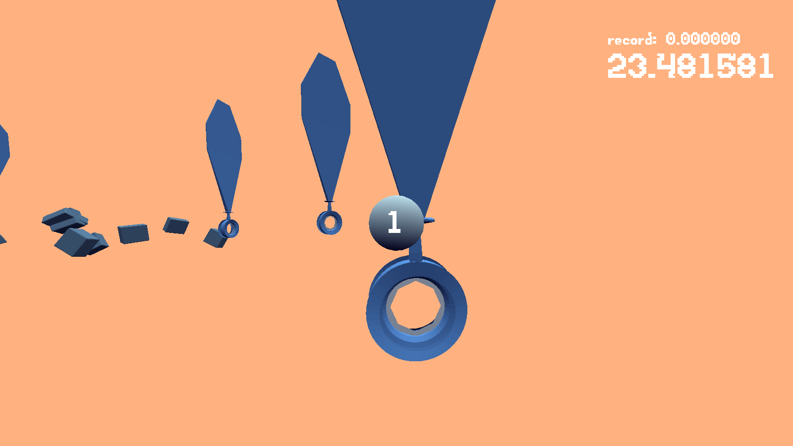

# Sphere Flier

Author: Jan Orlowski

Design: Fly through all the loops as fast as possible!

Screen Shot:

How To Play:

Mouse to angle camera. Left click to speed up (note: movement limited when speeding up, slow down to turn). Esc to quit.

Sources:

I made all of the 3D models by extending the example game4 blender file. Text font used is the trade font by Jim McCann.

This game was built with [NEST](NEST.md).
